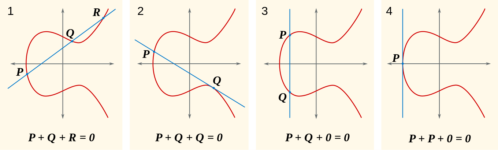
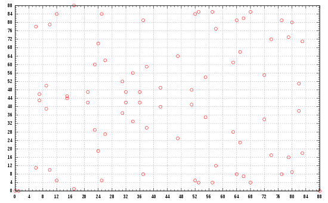

# Understanding threshold ecdsa

## Part I:  基于离散对数的签名方案 

Discrete-logarithm-based Signature Schemes

### ELGamal 

#### setup

模p乘法群，p是一个N比特的素数，群的生成元g；密码学哈希函数H 

#### key generation

私钥 x ∈ {1, 2, .., p-2} ，公钥 

 

#### sign 

选择随机数 k ∈ {2, 3, .., p-2}，与 p-1互质 

   

签名为(r, s)

#### verify

0 &lt; r &lt; p, 0 &lt; s &lt; p-1

### DSA

ELGamal的变种和标准化(by NIST)

#### setup 

素数q(长度N比特)，素数p(长度L比特)，(L, N) ∈ {(1024, 160), (2048, 224), (2048, 256), (3072, 256)}，p-1 = qm；计算g = h^(p-1)/q，h多取2；密码学哈希函数Sha2, Sha3；

#### key generation

私钥 x ∈ {1, 2, .., q-1} ，公钥 

#### sign

  

签名为(r, s)

#### verify

0 &lt; r &lt; q, 0 &lt; s &lt; p

  

  

  

  

### ECDSA 

DSA over Elliptic Curve Group 

#### setup

椭圆曲线curve，基点G(生成元)生成一个阶为n的素数群；密码学哈希函数Sha2, Sha3；

椭圆曲线群的构造 

形如: 

 

的平面代数曲线E，
没有奇异点，即无尖点、自相交，即判别式

 不等于0。

定义E上的加法运算：取E上的两点P, Q，若两者相异，P + Q表示穿过P和Q的弦和椭圆曲线相交的第三点，再经x轴反射的镜像点。

1. 当P,Q不重合且过PQ的直线不与y轴平行，可验证该直线必交E与第三点R，P + Q = -R；
2. 当Q,Q重合，若取过该点E的切线且不与y轴平行，可验证必交E与第三点P，Q + Q = -P；
3. 当过PQ的直线与y轴平行，认为交E与无限远点O，P + Q = O；

如下，实数域上的示意图：

满足：

1. 存在单位元，定义为无穷远处点O； 
2. 存在逆元，即任意P(x, y)，存在Q(x, -y)，P + Q = Q + P = O；
3. 封闭性：任取两点P，Q，P + Q = R，R仍在E上；
4. 结合律：任取两点P，Q，(P + Q) + R = P + (Q + R)
5. 交换律：任取两点P，Q，P + Q = Q + P

则(E, +)是一个阿贝尔群。

密码学使用的椭圆曲线群一般定义在有限域GF(p)(或Fp)上，记为E(Fp)，依旧满足以上性质。至于为什么选择有限域不在这里讨论。

举例1：

曲线E

 

有限域Fp, p = 89

举例2: secp256k1

曲线E 

 

有限域Fp, p = 0xfffffffffffffffffffffffffffffffffffffffffffffffffffffffefffffc2f = = 2^256 - 2^32 - 2^9 - 2^8 - 2^7 - 2^6 - 2^4 - 1

基点G坐标：

Gx = 0x79be667ef9dcbbac55a06295ce870b07029bfcdb2dce28d959f2815b16f81798 

Gy = 0x483ada7726a3c4655da4fbfc0e1108a8fd17b448a68554199c47d08ffb10d4b8

以G为生成元，生成的最大素子群的阶为
n =  0xfffffffffffffffffffffffffffffffebaaedce6af48a03bbfd25e8cd0364141

该曲线上的点的个数为#E(Fp) = h · n，h = 1为余因子

#### key generation

私钥 x  ∈ {1, 2, .., n-1}，公钥 Q = xG(即G+G+G..+G，共x次加法)

#### sign

取随机数 k  ∈ {1, 2, .., n-1}
, 计算曲线上点(x1, y1) = kG，x1, y1 ∈ Fp，

r = x1 mod n，若r=0回到上一步

签名是(r, s) or (r, -s mod n)

#### verify

验证Q是合法的：1）Q不是单位元O，2)Q在E上，3) nQ = O

验证r, s ∈ {1, 2, .., n-1}

  

  

  

如果 r= x1 mod n，则签名合法。
<!-- 

### EdDSA

todo

### Schnorr

todo

### BLS

todo -->

## Part II: 门限签名方案

<!-- ### Bitcoin脚本 p2sh-multisig

栈式计算机，(t, n, pk1, pk2, ..pkn)

### 智能合约

### Schnorr

### BLS -->

### ECDSA

论文[Fast Multiparty Threshold ECDSA with Fast Trustless Setup paper](paper/gg_2019.pdf)。

实现：[KZen-networks](https://github.com/KZen-networks/multi-party-ecdsa)

#### 原理：

1. Distributed Key Generation, DKG协议：

<!-- ## Impl

https://github.com/Turing-Chain/TSSKit-Threshold-Signature-Scheme-Toolkit
 -->

